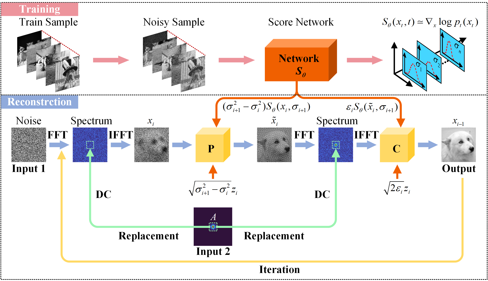

# FSPI-DM
**Paper:** High-resolution iterative reconstruction at extremely low sampling rate for Fourier single-pixel imaging via diffusion model     
**Authors:** Xianlin Song, Xuan Liu, Zhouxu Luo, Jiaqing Dong, Wenhua Zhong, Guijun Wang, Binzhong He, Qiegen Liu      
Optics Express 32 (3), 3138-3156, 2024       
https://opg.optica.org/oe/fulltext.cfm?uri=oe-32-3-3138&id=545621       
      
Date : Jan-9-2024  
Version : 1.0  
The code and the algorithm are for non-comercial use only.  
Copyright 2024, Department of Electronic Information Engineering, Nanchang University.  

The trade-off between imaging efficiency and imaging quality has always been encountered by Fourier single-pixel imaging (FSPI). To achieve high-resolution imaging, the increase in the number of measurements is necessitated, resulting in a reduction of imaging efficiency. Here, a novel high-quality reconstruction method for FSPI imaging via diffusion model was proposed. A score-based diffusion model is designed to learn prior information of the data distribution. The real-sampled low-frequency Fourier spectrum of the target is employed as a consistency term to iteratively constrain the model in conjunction with the learned prior information, achieving high-resolution reconstruction at extremely low sampling rates. The performance of the proposed method is evaluated by simulations and experiments. The results show that the proposed method has achieved superior quality compared with the traditional FSPI method and the U-Net method. Especially at the extremely low sampling rate (e.g., 1%), an approximately 241% improvement in edge intensity-based score was achieved by the proposed method for the coin experiment, compared with the traditional FSPI method. The method has the potential to achieve high-resolution imaging without compromising imaging speed, which will further expanding the application scope of FSPI in practical scenarios.

# Scheme of the system and the photographs of practical system.

# Flow chart of high-resolution iterative reconstruction based on diffusion model.

# The reconstruction results obtained by different methods for animal and coin under various sampling rates, as well as the corresponding ground truth and Fourier spectra.

# Requirements and Dependencies
python==3.7.11  
Pytorch==1.7.0  
tensorflow==2.4.0  
torchvision==0.8.0  
tensorboard==2.7.0  
scipy==1.7.3  
numpy==1.19.5  
ninja==1.10.2  
matplotlib==3.5.1  
jax==0.2.26  

# Checkpoints
We provide pretrained checkpoints of the dog. You can download pretrained models from [Baidu cloud] (https://pan.baidu.com/s/1IYIG5fQ_Ju_iRAbX455dSg) Extract the code (FSPI)

# Dataset
* The data set used to train the model in this experiment comes from https://www.kaggle.com/datasets/unmoved/30k-cats-and-dogs-150x150-greyscale/data. We have extracted some uncontaminated images as training set, validation set and test set. Corresponds to "Training_set", "Validation_set" and "Test_set" in the warehouse  
* The dog data used in the paper is located in the "Paper_data_dog" folder in the warehouse

# Train:
1. Replace the train_ds and eval_ds variables in the datasets.py file with the corresponding paths.
2. Use the following command to train：  
   CUDA_VISIBLE_DEVICES=0 python main.py --config=aapm_sin_ncsnpp_gb.py --workdir=exp --mode=train --eval_folder=result

# Test:
1. Modify the ckpt_filename variable in A_PCsampling_demo.py to the corresponding checkpoint address  
2. Enter the file address of the low-frequency Fourier coefficients obtained after sampling into the y_k variable in the A_sampling.py file  
3. Use the following command to test：  
CUDA_VISIBLE_DEVICES=0 python A_PCsampling_demo.py

# Acknowledgement
The implementation is based on this repository: https://github.com/yang-song/score_sde_pytorch.

# Other Related Projects
 * Diffusion Models for Medical Imaging
[**[Paper]**](https://github.com/yqx7150/Diffusion-Models-for-Medical-Imaging)   [**[Code]**](https://github.com/yqx7150/Diffusion-Models-for-Medical-Imaging)   [**[PPT]**](https://github.com/yqx7150/HKGM/tree/main/PPT)  
  * Homotopic Gradients of Generative Density Priors for MR Image Reconstruction  
[**[Paper]**](https://ieeexplore.ieee.org/abstract/document/9435335)   [**[Code]**](https://github.com/yqx7150/HGGDP)   [**[PPT]**](https://github.com/yqx7150/HGGDP/tree/master/Slide)
  * Multi-Channel and Multi-Model-Based Autoencoding Prior for Grayscale Image Restoration  
[**[Paper]**](https://ieeexplore.ieee.org/stamp/stamp.jsp?tp=&arnumber=8782831)  [**[Code]**](https://github.com/yqx7150/MEDAEP)   [**[Slide]**](https://github.com/yqx7150/EDAEPRec/tree/master/Slide)  [**[数学图像联盟会议交流PPT]**](https://github.com/yqx7150/EDAEPRec/tree/master/Slide)

  * Highly Undersampled Magnetic Resonance Imaging Reconstruction using Autoencoding Priors  
[**[Paper]**](https://cardiacmr.hms.harvard.edu/files/cardiacmr/files/liu2019.pdf)  [**[Code]**](https://github.com/yqx7150/EDAEPRec)   [**[Slide]**](https://github.com/yqx7150/EDAEPRec/tree/master/Slide) [**[数学图像联盟会议交流PPT]**](https://github.com/yqx7150/EDAEPRec/tree/master/Slide)

  * High-dimensional Embedding Network Derived Prior for Compressive Sensing MRI Reconstruction  
 [**[Paper]**](https://www.sciencedirect.com/science/article/abs/pii/S1361841520300815?via%3Dihub)   [**[Code]**](https://github.com/yqx7150/EDMSPRec)
 
  * Denoising Auto-encoding Priors in Undecimated Wavelet Domain for MR Image Reconstruction  
[**[Paper]**](https://www.sciencedirect.com/science/article/pii/S0925231221000990) [**[Paper]**](https://arxiv.org/ftp/arxiv/papers/1909/1909.01108.pdf)  [**[Code]**](https://github.com/yqx7150/WDAEPRec)
  
  * Learning Multi-Denoising Autoencoding Priors for Image Super-Resolution  
[**[Paper]**](https://www.sciencedirect.com/science/article/pii/S1047320318302700)   [**[Code]**](https://github.com/yqx7150/MDAEP-SR)

  * REDAEP: Robust and Enhanced Denoising Autoencoding Prior for Sparse-View CT Reconstruction  
[**[Paper]**](https://ieeexplore.ieee.org/document/9076295)   [**[Code]**](https://github.com/yqx7150/REDAEP)   [**[PPT]**](https://github.com/yqx7150/HGGDP/tree/master/Slide)  [**[数学图像联盟会议交流PPT]**](https://github.com/yqx7150/EDAEPRec/tree/master/Slide)

  * Iterative Reconstruction for Low-Dose CT using Deep Gradient Priors of Generative Model  
[**[Paper]**](https://ieeexplore.ieee.org/abstract/document/9703672)   [**[Code]**](https://github.com/yqx7150/EASEL)   [**[PPT]**](https://github.com/yqx7150/HGGDP/tree/master/Slide)

  * Universal Generative Modeling for Calibration-free Parallel MR Imaging  
[**[Paper]**](https://biomedicalimaging.org/2022/)   [**[Code]**](https://github.com/yqx7150/UGM-PI)   [**[Poster]**](https://github.com/yqx7150/UGM-PI/blob/main/paper%20%23160-Poster.pdf)

* Progressive Colorization via Interative Generative Models  
[**[Paper]**](https://ieeexplore.ieee.org/document/9258392)   [**[Code]**](https://github.com/yqx7150/iGM)   [**[PPT]**](https://github.com/yqx7150/HGGDP/tree/master/Slide)  [**[数学图像联盟会议交流PPT]**](https://github.com/yqx7150/EDAEPRec/tree/master/Slide)

* Joint Intensity-Gradient Guided Generative Modeling for Colorization
[**[Paper]**](https://arxiv.org/abs/2012.14130)   [**[Code]**](https://github.com/yqx7150/JGM)   [**[PPT]**](https://github.com/yqx7150/HGGDP/tree/master/Slide)  [**[数学图像联盟会议交流PPT]**](https://github.com/yqx7150/EDAEPRec/tree/master/Slide)

